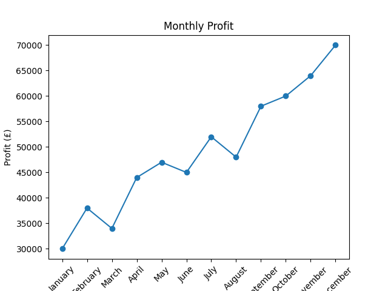

# Finance Data Analysis

This project analyses monthly revenue, costs and profitability using Python and pandas.

## Key Results

- Total Revenue: £1,865,000
- Total Costs: £1,275,000
- Total Profit: £590,000
- Annual Profit Margin: 31.64%
- Best Month: December
- Worst Month: January

## Monthly Profit Chart

